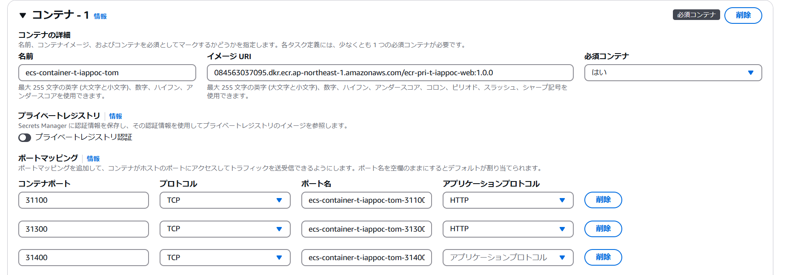

# ECR登録～ECS起動までの流れ

### 1. 前提
認証情報を取得し環境変数に設定されていること。   
DockerDesktopがインストールされていること。  
このドキュメントはタスク定義のすべての手順を説明していません。  
必要に応じて、タスクロール、タスク実行ロール、ロギングなどの設定をしてください。

### 1. イメージを作成
Dockerfileが存在するディレクトリに移動し下記コマンドを実行

```Docker Build
docker build  -t [アプリ名]:[タグ名] .

例）
docker build  -t apl01:1.0.0 .
```  

### 1. ECRに登録するためにタグ付け
```Tag
docker tag [アプリ名]:[タグ名] [AWSアカウント].dkr.ecr.ap-northeast-1.amazonaws.com/[リポジトリ名]:[タグ名]

例）
docker tag apl01:1.0.0 084563037095.dkr.ecr.ap-northeast-1.amazonaws.com/ecr-pri-t-iappoc-web:1.0.0
```  


### 1. イメージをECRに登録
```ecr_ppush
docker push [AWSアカウント].dkr.ecr.ap-northeast-1.amazonaws.com/[リポジトリ名]:[タグ名]

例）
docker push 084563037095.dkr.ecr.ap-northeast-1.amazonaws.com/ecr-pri-t-iappoc-web:1.0.0
```  


### 1. タスク定義の登録

ECRに登録したイメージURI、ポートマッピングを記載し、タスク定義にコンテナを登録する
  


### 1. コンテナを起動する
サービスの必要なタスク数を設定し更新する。


