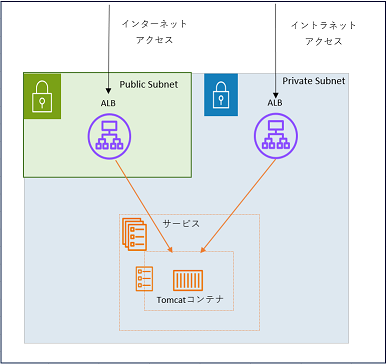

# FAQ

### 1. ECSサービスを複数のターゲットグループを登録する
  

-上記図のように、インターネットおよびイントラネットで同一のサービスにルーティングしたい場合、  
ECSサービスを複数のTGに登録することで実現できます。 

登録する方法はマネージメントコンソールは対応しておらず、CLIにて登録可能です。

#### 1-1. サービス作成時に登録を行う。
```exec1
aws ecs create-service `
 --cluster クラスタ名 `
 --service-name サービス名 `
 --task-definition タスク定義名:リビジョン `
 --load-balancers targetGroupArn=TG1のARN,containerName=コンテナ名,containerPort=ポート番号 targetGroupArn=TG2のARN,containerName=コンテナ名,containerPort=ポート番号 `
 --desired-count 1 `
 --launch-type FARGATE `
 --platform-version 1.4.0 `
 --network-configuration "awsvpcConfiguration={subnets=[サブネットID,サブネットID,サブネットID],securityGroups=[SGのID],assignPublicIp=DISABLED}" `
 --deployment-controller type=ECS `
 --health-check-grace-period-seconds 120

```  
#### 1-2. 既存のサービスにTGを追加する
```exec1
aws ecs update-service `
--cluster クラスタの名 `
--service サービス名 `
--load-balancers targetGroupArn=TG1のARN,containerName=コンテナ名,containerPort=ポート番号 targetGroupArn=TG2のARN,containerName=コンテナ名,containerPort=ポート番号 `
```  

※現業務系で実現したい場合には、ECSパラメータシート（ECSサービス→ロードバランシング→ターゲットグループ）に  
２つのTGを記載する


