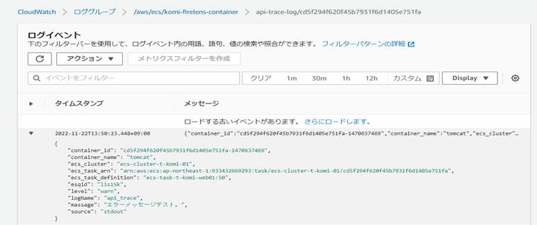
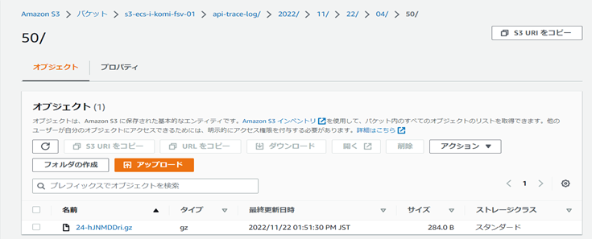
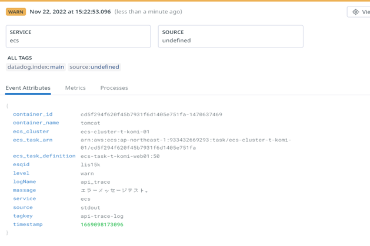

# Fluent Bitテンプレート利用ガイド

## 2.設定ファイルと出力

<details open markdown="block">
  <summary>
    目次
  </summary>
  {: .text-delta }

  - TOC
  {:toc}
</details>

---

### 2-1．ログ出力  
下記のサンプルのように`logName`, `level`, `message`の3つの項目を持つログを`Json形式`で出力します。  
以降、このログを使用し説明します。

```sh
# ログサンプル
{
	"esqid": "lis15k",
	"logName": "api_trace",
	"level": "warn",
	"message": "エラーメッセージテスト。"
}
```  
<br>

### 2-2．StreamProcessorの設定ファイル作成  
1. `apl_stream_processor.conf`という名前のファイルを作成します。
1. `apl_stream_processor.conf`に下記サンプルを元に設定を記載します。  
<br>

この例では`logName`が`api_trace`のログを`\*-firelens-\*`というタグ（標準仕様）が付与された`Stream`より抽出します。  
<span style="color: red; ">`api_trace`</span>という名前、<span style="color: red; ">`api-trace-log`</span>というタグ名で新規に`Stream`を作成します。  

```sh
# apl_stream_processor.conf
[STREAM_TASK]
    Name api_trace
    Exec CREATE STREAM api_trace WITH (tag='api-trace-log') AS SELECT * FROM TAG:'*-firelens-*' WHERE logName = 'api_trace' ;
```

{: .note}  
LogName `api_trace` の名前は任意  

<br>

### 2-3．CloudWatch Logsへの出力設定作成  
1. `apl_output_cloudwatch.conf`という名前のファイルを作成します。
1. `apl_output_cloudwatch.conf`に下記サンプルを元に設定を記載します。  
<br>

この例では<span style="color: red; ">`api-trace-log`</span>というタグが付与された`Stream`を、  
ロググループ`${LOG_GROUP_NAME}`へ`api-trace-log`という名前の`prefix`を付けてログストリームへ送信します。  

```sh
# apl_output_cloudwatch.conf
[OUTPUT]		
    Name   cloudwatch		
    Match  api-trace-log		
    region ${AWS_REGION}		
    log_group_name ${LOG_GROUP_NAME}		
    log_stream_name api-trace-log/$(ecs_task_id)		
```
{: .note}  
`apl-trace-log`の名前は任意  

  
<br>

### 2-4．S3への出力設定作成  
1. `apl_output_s3.conf`という名前のファイルを作成します。
1. `apl_output_s3.conf`に下記サンプルを元に設定を記載します。  
<br>

この例では<span style="color: red; ">`apl-trace-log`</span>というタグが付与された`Stream`を、  
バケット名 `${LOG_BUCKET_NAME}`へ送信します。

```sh
# apl_output_s3.conf
[OUTPUT]	
    Name s3	
    Match  api-trace-log	
    region ${AWS_REGION}	
    bucket ${LOG_BUCKET_NAME}	
    json_date_key false	
    total_file_size 1M	
    upload_timeout 1m	
    s3_key_format /$TAG/%Y/%m/%d/%H/%M/%S-$UUID.gz	
    use_put_object On	
    compression gzip	
    content_type application/gzip	
	
```

{: .note}  
`apl-trace-log`の名前は任意  

  

{: .tip}  
TomcatやNginxのログをS3に保管する場合、<a href="https://esq365.sharepoint.com/:u:/s/msteams_30dfd0/EaEExF6HxKtLlbMhnwmHfmUBAGnHI_fq5WKCa2PQxwixpQ?e=icnif9">こちら</a>を使用してください。  


### 2-5．Datadogへの出力設定作成  

{: .caution}  
この設定は<span style="color: red; ">本番環境</span>のみ必要となります。    

1. `apl_output_dd.conf`という名前のファイルを作成します。
1. `apl_output_dd.conf`に下記サンプルを元に設定を記載します。  
<br>
この例では<span style="color: red; ">`api-trace-log`</span>というタグが付与された`Stream`を、  
`${DD_API_KEY}`を発行した`Datadog Organization`へ送信します。

{: .note}  
「監視設定依頼シート」を記載し、SS-監視チームに申請すると発行頂けます。

```sh
# apl_output_dd.conf
[OUTPUT]		
    Name        datadog		
    Match       api-trace-log		
    Host        http-intake.logs.datadoghq.com		
    TLS         on		
    apikey      ${DD_API_KEY}		
    dd_service  ecs		
    compress    gzip		
    include_tag_key true		

```

{: .note}  
`apl-trace-log`の名前は任意  
  

この時、`Datadog`はログ中の`level`, `message`によって下記のように処理を行います。  

| level | 処理内容 | 
| ------ | ------ |
| info | 処理しない |
| warn | 警戒域の処理を行う（デフォルト`message:*`） |
| error | 危険域の処理を行う（デフォルト`message:*`） |

  
<br>
### 2-6．NewRelicへの出力設定作成  

{: .caution}  
この設定は<span style="color: red; ">本番環境</span>のみ必要となります。    

1. `apl_output_nr.conf`という名前のファイルを作成します。
1. `apl_output_nr.conf`に下記サンプルを元に設定を記載します。  
<br>
この例では<span style="color: red; ">`api-trace-log`</span>というタグが付与された`Stream`を、  
`${NR_LICENSE_KEY}`を発行した`NewRelicアカウント`へ送信します。

{: .note}  
「監視設定依頼シート」を記載し、SS-監視チームに申請すると発行頂けます。

```sh
# apl_output_nr.conf
[OUTPUT]		
    Name       newrelic
    Match      api-trace-log
    licenseKey ${NR_LICENSE_KEY}

```

{: .note}  
`apl-trace-log`の名前は任意  
  

この時、`NewRelic`はログ中の`level`, `message`によって下記のように処理を行います。  

| level | 処理内容 | 
| ------ | ------ |
| info | 処理しない |
| warn | 警戒域の処理を行う（デフォルト`message:*`） |
| error | 危険域の処理を行う（デフォルト`message:*`） |

  
<br>

<br><br>

<p style="margin-top: 20em"></p>  

| 関連ドキュメント | 説明 | 
| ------ | ------ |
| [コンテナロギング方式設計20230303.docx](/files/基本設計書/コンテナロギング方式設計20230303.docx) | コンテナのロギング（監視含む）及びログルータの設計に関して | 
| [コンテナロギング運用設計書20221121.docx](/files/基本設計書/コンテナロギング運用設計書20221121.docx) | コンテナのロギング（監視含む）及びログルータの運用設計に関して |  

<div style="display: flex; justify-content: space-between;">
  <div style="text-align: center;">
    <a href="/deploy/fluentbit/introduction">←1.テンプレート適用の流れ</a>
  </div>
  <div style="text-align: center;">
　　<a href="/deploy/fluentbit/firelens">3.タスク定義の変更→</a>
  </div>
</div>