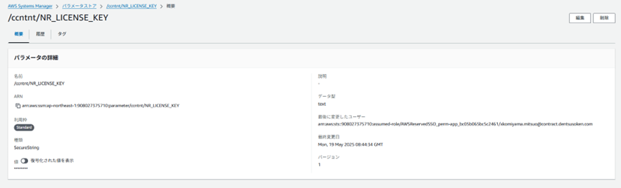

# Fluent Bitテンプレート利用ガイド

## 3.タスク定義の変更

<details open markdown="block">
  <summary>
    目次
  </summary>
  {: .text-delta }

  - TOC
  {:toc}
</details>

---

### 3-1．FireLensコンテナの追加  
下記のように`FireLensコンテナ`を追加します。

| FireLensの統合を有効化する | チェック |
| タイプ | `fluentbit`を選択 |
| イメージ | [コンテナチーム管理のベースイメージ>fluentbitのURIを入力](https://dgcp-ope.backlog.com/wiki/DGCP_APP_CONTAINER_RECEPT/%E3%82%B3%E3%83%B3%E3%83%86%E3%83%8A%E3%83%81%E3%83%BC%E3%83%A0%E7%AE%A1%E7%90%86%E3%81%AE%E3%83%99%E3%83%BC%E3%82%B9%E3%82%A4%E3%83%A1%E3%83%BC%E3%82%B8){:target="_blank"} |
  
  
この操作で`FireLensコンテナ`が`サイドカー`として同じタスク内に配置されます。  

{: .warning}  
[1.1 設定ファイル配置場所の決定](/deploy/fluentbit/introduction.html#1-1設定ファイル配置場所の決定)で`2.カスタムイメージの作成`を選択した場合は、該当のリポジトリとイメージを指定ください。  

<br>

### 3-2．アプリコンテナの定義変更  
下記のようにアプリコンテナの定義を変更します。

| ログ設定（`Auto-configure CloudWatch Logs`） | チェックを外す |
| ログドライバ | `awsfirelens`を選択 |
| ログオプション | 指定しない |

  

{: .tip}  
ログオプションに`Name`が設定されている場合は、1度更新を完了してください。  
再度コンテナ定義画面を開き`Name`キーを削除してください。  
<br>

### 3-3．パラメータストアにNewRelicライセンスキーを追加  
{: .note}  
NewRelic使用時のみ実施してください。  

パラメータストアにライセンスキーを下記の名前で、SecureStringとして追加してください。  

名前：/システム識別子/NR_LICENSE_KEY
  


<br>

### 3-4．FireLensコンテナに環境変数を追加  
下記のように`FireLensコンテナ`の環境変数を変更します。  
  

| 変数名 | 値 | 備考 |
| -- | -- | -- |
| LOG_GROUP_NAME | `CloudWatch Logs`の`ロググループ名`を指定 | 必須<br>[1.2 ログの出力先決定](/deploy/fluentbit/introduction.html#1-2ログ出力先の決定)を参照 |
| LOG_BUCKET_NAME | `S3のバケット名`を指定 | [1.2 ログの出力先決定](/deploy/fluentbit/introduction.html#1-2ログ出力先の決定)を参照 |
| CONF_BUCKET_DIR | `S3のバケット名` + `設定ファイル直上のディレクトリ名`を指定<br>例：)`s3-t-iappoc-fsv-01/firelens/conf `| [1.1 設定ファイル配置場所の決定](/deploy/fluentbit/introduction.html#1-1設定ファイル配置場所の決定)で`1.S3に配置`を選択した場合に必要 |
| DD_API_KEY | `DataDogのAPIキー`を指定 | [2-5．Datadogへの出力設定作成](/deploy/fluentbit/introduction.html#2-5．Datadogへの出力設定作成 )を参照 |
| NR_LICENSE_KEY | `3-3で作成したパラメータストア`を指定 | [2-6．NewRelicへの出力設定作成](/deploy/fluentbit/introduction.html#2-6．NewRelicへの出力設定作成)を参照 |

{: .note}  
（2025年現在）NR_LICENSE_KEYはNewRelicログ監視利用時に設定します。  
  
<br>

### 3-5．FireLensコンテナに環境ファイルを追加  
現業務系の場合、DGCP標準（プロキシ設定等）の環境変数一覧または`Datadog`の`APIKey`を注入します。
  

| S3 ARN(Datadog) | `arn:aws:s3:::s3-[環境識別子]-cinfrs-fsv-common-file/[システム識別子]/datadog.env` |
| S3 ARN(DGCP標準) | `arn:aws:s3:::s3-[環境識別子]-cinfrs-fsv-common-file/ccntnr/dgcp_[環境識別子]_ccntnr.env` |  

{: .tip}  
環境識別子は非本番は[t]、本番[p]となります。  

{: .note}  
新業務系基盤では、Systems Managerパラメータストアにて、`HTTPS_PROXY` `HTTP_PROXY` `NO_PROXY`が設定されています。  
タスク定義 > 環境変数 > キーのタイプ`ValueFrom`にて設定してください。  
`例：） Name:HTTPS_PROXY, ValueFrom:HTTPS_PROXY`  

  
<br>

### 3-6．FireLensコンテナのログ出力設定を追加  
Firelensコンテナ（`Fluent Bit`）自体のログ設定を下記の通り行います。

|||
| -- | -- |
| ログ設定（`Auto-configure CloudWatch Logs`） | チェックを外す |
| ログドライバ | `awslogs`を選択 |
| ログオプション | 下記のkey value表の通りに指定 |

  

| Key | 値 | 備考 |
| -- | -- | -- |
| awslogs-group | `CloudWatch Logs`の`ロググループ名`を指定 |  |
| awslogs-region | ap-northeast-1 |  |
| awslogs-stream-prefix | firelens |  |
  
<br>

### 3-7．FireLensコンテナのカスタム定義を追加  
`Firelensコンテナ`で利用する設定ファイルのパスを設定します。  

`JSON`による設定を行います。  
  

```sh
# taskdef.json
# 設定前
"firelensConfiguration": {
        "type": "fluentbit"
      }
```

```sh
# taskdef.json
# 設定後
"firelensConfiguration": {
        "type": "fluentbit",
        "options": {
          "config-file-type": "file",
          "config-file-value": "/fluent-bit/fluent-bit-custom.conf"
        }
      }

```

{: .important}  
option属性は全て追加してください。  

<br>

<br><br>

<p style="margin-top: 20em"></p>  

| 関連ドキュメント | 説明 | 
| ------ | ------ |
| [コンテナロギング方式設計20230303.docx](/files/基本設計書/コンテナロギング方式設計20230303.docx) | コンテナのロギング（監視含む）及びログルータの設計に関して | 
| [コンテナロギング運用設計書20221121.docx](/files/基本設計書/コンテナロギング運用設計書20221121.docx) | コンテナのロギング（監視含む）及びログルータの運用設計に関して |  

<div style="display: flex; justify-content: space-between;">
  <div style="text-align: center;">
    <a href="/deploy/fluentbit/configuration">←2.設定ファイルと出力</a>
  </div>
  <div style="text-align: center;">
　　<a href="/deploy/fluentbit/troubleshooting">4.トラブルシュート→</a>
  </div>
</div>