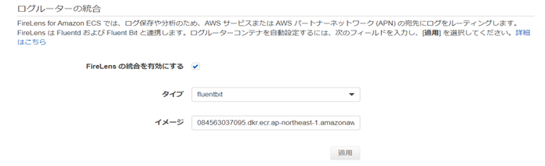
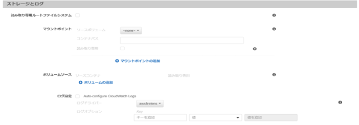
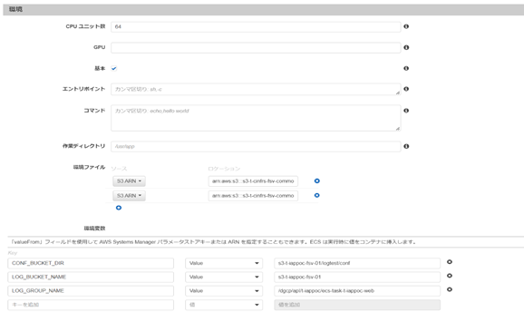
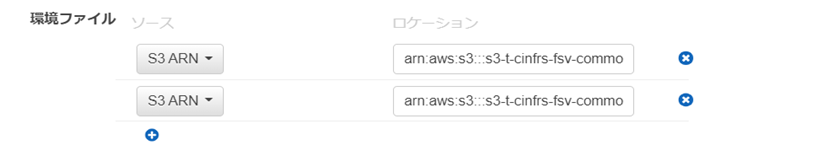
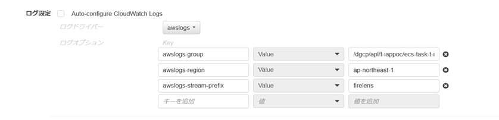
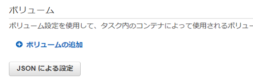

# Fluent Bitテンプレート利用ガイド
## 目次
- [概要](/fluentbit/#概要)
- [1.テンプレート適用の流れ](/fluentbit/#1テンプレート適用の流れ)
- [2.設定ファイルと出力](/fluentbit/configuration.html)
- [3.タスク定義の変更](/fluentbit/firelens.html)　**←本ページ**
- [4.トラブルシュート](/fluentbit/troubleshooting.html)

<br>

---

<br><br>

## 3.タスク定義の変更
### 3-1．FireLensコンテナの追加  
下記のようにFireLensコンテナを追加します。

|||
| -- | -- |
| FireLensの統合を有効化する | チェック |
| タイプ | fluentbitを選択 |
| イメージ | イメージARNを入力 |
  
  
この操作でFireLensコンテナがサイドカーとして同じタスク内に配置されます。  
※イメージの配置場所は、標準を利用する場合は、公開用ECRにあります。  
作成した場合は、該当のリポジトリとイメージを指定ください。  
<br>

### 3-2．アプリコンテナの定義変更  
下記のようにアプリコンテナの定義を変更します。

|||
| -- | -- |
| ログ設定（Auto-configure CloudWatch Logs） | チェックを外す |
| ログドライバ | awsfirelensを選択 |
| ログオプション | 指定しない |

  
※ログオプションに「Name」が設定されている場合は、1度更新を完了してください。<br>
再度コンテナ定義画面を開き「Name」キーを削除してください。
<br>

### 3-3．FireLensコンテナに環境変数を追加  
下記のようにFireLensコンテナの環境変数を変更します。  
  

| 変数名 | 値 | 備考 |
| -- | -- | -- |
| LOG_GROUP_NAME | CloudWatch Logsのロググループ名を指定 | 必須。「1.2 ログの出力先決定」を参照 |
| LOG_BUCKET_NAME | S3のバケット名を指定 | 「1.2 ログの出力先決定」を参照 |
| CONF_BUCKET_DIR | S3のバケット名+設定ファイル直上のディレクトリ名を指定<br>例：)s3-t-iappoc-fsv-01/firelens/conf | 「1.1 設定ファイル配置場所の決定」でS3を選択した場合に必要 |
  
<br>

### 3-4．FireLensコンテナに環境ファイルを追加  
DGCP標準（プロキシ設定等）の環境変数一覧またはDatadogのAPIKeyを注入します。
  

|||
| -- | -- |
| S3 ARN(Datadog) | arn:aws:s3:::s3-[環境識別子]-cinfrs-fsv-common-file/[システム識別子]/datadog.env |
| S3 ARN(DGCP標準) | arn:aws:s3:::s3-[環境識別子]-cinfrs-fsv-common-file/ccntnr/dgcp_[環境識別子]_ccntnr.env |  

※環境識別子は本番[p]、非本番は[t]となります。
  
<br>

### 3-5．FireLensコンテナのログ出力設定を追加  
Firelensコンテナ（Fluent Bit）自体のログ設定を下記の通り行います。

|||
| -- | -- |
| ログ設定（Auto-configure CloudWatch Logs） | チェックを外す |
| ログドライバ | awslogsを選択 |
| ログオプション | 下記のkey value表の通りに指定 |

  

| Key | 値 | 備考 |
| -- | -- | -- |
| awslogs-group | CloudWatch Logsのロググループ名を指定 |  |
| awslogs-region | ap-northeast-1 |  |
| awslogs-stream-prefix | firelens |  |
  
<br>

### 3-6．FireLensコンテナのカスタム定義を追加  
Firelensコンテナで利用する設定ファイルのパスを設定します。  

JSONによる設定を行います。  
  

```sh
# taskdef.json
# 設定前
"firelensConfiguration": {
        "type": "fluentbit"
      }
```

```sh
# taskdef.json
# 設定後
"firelensConfiguration": {
        "type": "fluentbit",
        "options": {
          "config-file-type": "file",
          "config-file-value": "/fluent-bit/fluent-bit-custom.conf"
        }
      }

```
※option属性を全て追加してください。

<br>

<br><br>

<p style="margin-top: 20em"></p>  

| 関連ドキュメント | 説明 | 
| ------ | ------ |
| [コンテナロギング方式設計20230303.docx](/files/基本設計書/コンテナロギング方式設計20230303.docx) | コンテナのロギング（監視含む）及びログルータの設計に関して | 
| [コンテナロギング運用設計書20221121.docx](/files/基本設計書/コンテナロギング運用設計書20221121.docx) | コンテナのロギング（監視含む）及びログルータの運用設計に関して |  

<div style="display: flex; justify-content: space-between;">
  <div style="text-align: center;">
    <a href="/fluentbit/configuration">←2.設定ファイルと出力</a>
  </div>
  <div style="text-align: center;">
　　<a href="/fluentbit/troubleshooting">4.トラブルシュート→</a>
  </div>
</div>