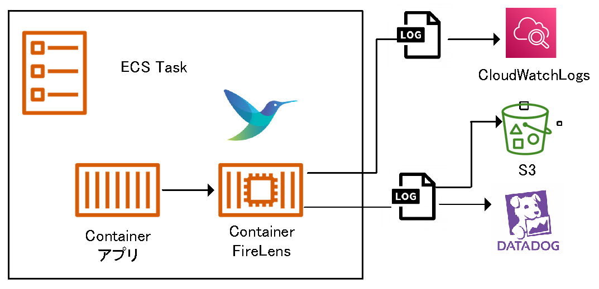

# Fluent Bitテンプレート利用ガイド

## 概要
`Fluent Bit(フルエントビット)`は、`C言語`で書かれたクラウド及びコンテナ環境に適した、ログの収集、配布を行うオープンソースのログプロセッサツールです。  
ECSでは、ログドライバとして`CloudWatch Logs`へ転送する`awslogs`か`FireLens`のいずれかを指定する必要があります。  
`CloudWatch Logs`や`S3`など複数の送信先がある場合、またはDGCP標準監視である`Datadog`にてログを監視する場合は、利用が必須となりますが、非機能要件としての対応となり、工数が発生します。  
そこで、対応の効率化を目的にDGCPのコンテナ標準として`Fluent Bit`のテンプレート設定が入ったイメージ及びガイドを展開します。  

