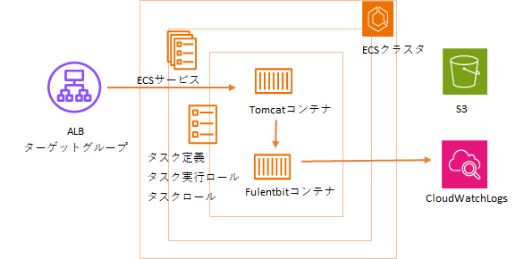

# Tomcat(MPA用)テンプレート利用ガイド
## 概要
このテンプレートは、CloudFormationを使用し下図に示すリソースを構築します。  

## 入力パラメータ
### Project Configuration

| パラメータ名 | 必須項目 | デフォルト | 説明 |  
| --- | --- | --- | --- |
| SystemId | 〇 | - | 実行するシステム識別子を入力 |  
| EnvType | 〇 | - | 実行環境名を選択 |  
| SecurityGroupIds | 〇 | - | セキュリティグループ名を入力 |  
| ACM | 〇 | - | ACM証明書のARNを入力 |  
| BillingID | 〇 | - | 請求IDを入力 |  

### ELB Configuration

| パラメータ名 | 必須項目 | デフォルト | 説明 |  
| --- | --- | --- | --- |
| TomHealthCheckPath | - | /mngcheck | ヘルスチェックパスを入力 |  
| Stickiness | - | true | Sticky Sessionの利用有無を入力 |  
| IdleTimeoutSeconds | - | 360 | アイドル接続状態解除までの時間（秒）を入力 |  

### ECS Configuration

| パラメータ名 | 必須項目 | デフォルト | 説明 |  
| --- | --- | --- | --- |  
| ClusterNameSuffix | - | ap01 | ヘルスチェックパスを入力 |  
| TomServiceNameSuffix | - | tom01 | Sticky Sessionの利用有無を入力 |  
| TomContainerPort | - | 31100 | アイドル接続状態解除までの時間（秒）を入力 |  
| TomECSTaskCPUUnit | - | 2048 | アイドル接続状態解除までの時間（秒）を入力 |  
| TomECSTaskMemory | - | 4096 | アイドル接続状態解除までの時間（秒）を入力 |  
| TomDesiredCount | - | 1 | アイドル接続状態解除までの時間（秒）を入力 |  

### S3 Configuration

| パラメータ名 | 必須項目 | デフォルト | 説明 |  
| --- | --- | --- | --- |
| BucketNameSuffix | - | fsv-01 | S3バケットのSuffixを入力 |  

{: .warning}  
既存環境に同じ名前のS3がある場合、サフィックスを変更してください。

### KMS Configuration

| パラメータ名 | 必須項目 | デフォルト | 説明 |  
| --- | --- | --- | --- |
| KMSKeyArn | - | - | KMSKeyのARNを入力 |  

## 出力リソース

| リソースの種類 | 出力例   
| --- | --- |
| ALB | alb-t-ccntnt-int-tom01 |  
| TargetGroup | alb-tg-t-ccntnt-int-tom01 |  
| ECSクラスタ | ecs-cluster-t-ccntnt-ap01 |  
| ECSサービス | ecs-service-t-ccntnt-tom01 |  
| タスク定義 | ecs-task-t-ccntnt-tom01 |  
| Task実行ロール | rol-t-ccntnt-taskexecute |  
| Taskロール | rol-t-ccntnt-task-tom01 |  
| Taskロールポリシー | pol-t-ccntnt-task-tom01 |  
| s3 | s3-t-ccntnt-fsv-01 |  
| CloudWatchロググループ | /ecs/ecs-task-t-ccntnt-tom01 |  

{: .note}  
出力例は、下記の入力パラメータを設定した場合に出力される値です。

| パラメータ名 | 値 |  
| --- | --- |
| SystemId | ccntnt |  
| EnvType | t |

## テンプレートの内部設計
[こちらを参照](./files/detail/tomcat(mpa)-template.htm)

