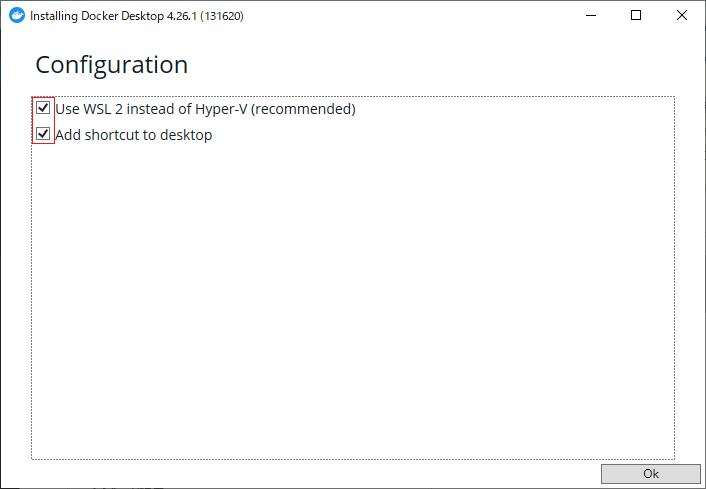
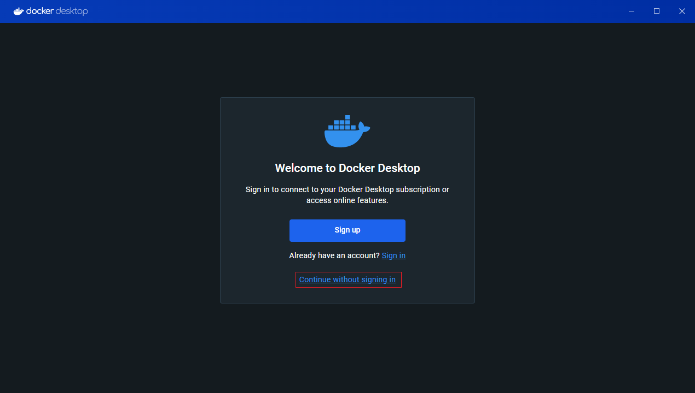
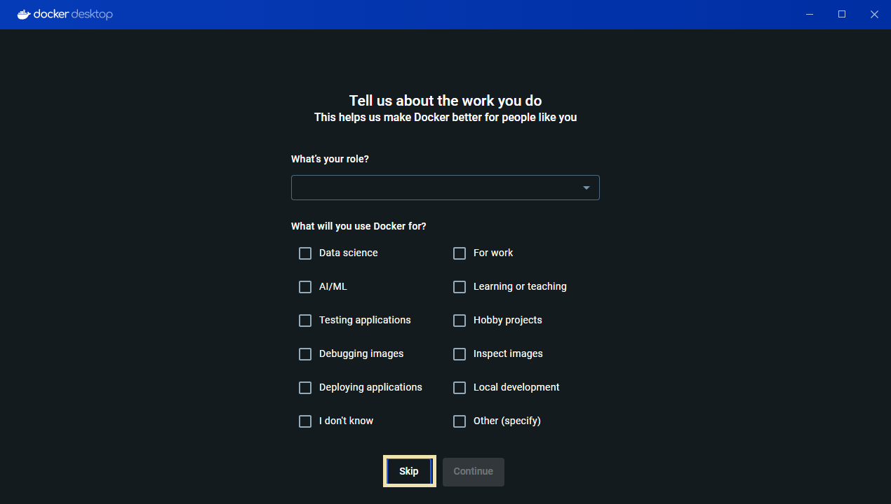
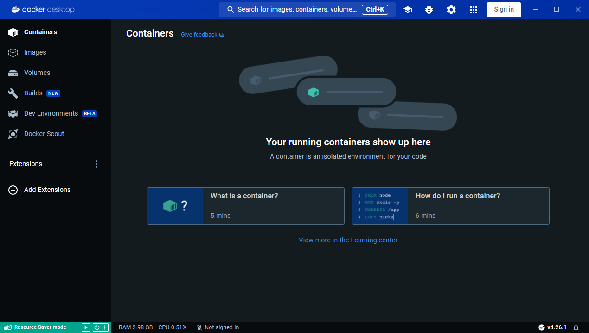
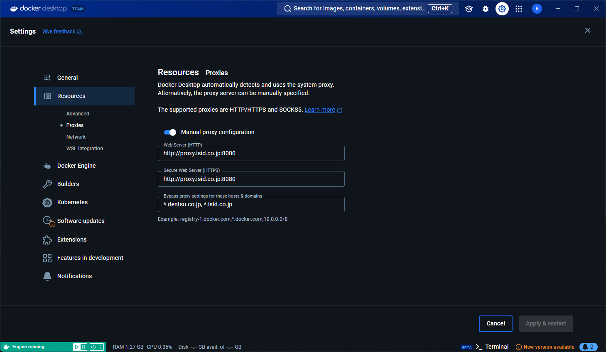
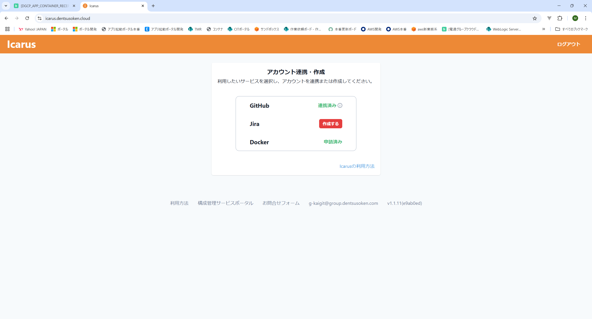
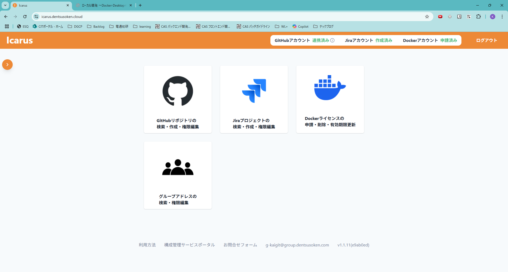
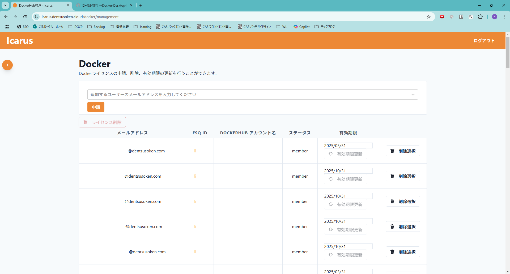

# ローカル開発 ～Docker-Desktopインストール～

* wsl2をインストールする。

```Powershell
wsl --install
#実行後下記が表示され、エラー表示されるが問題ない（Ubuntuのインストールエラー）。
インストール中: Linux 用 Windows サブシステム
Error: 0x80248014           0.0%                           ]
```
<br>

```Powershell
#正常にインストール出来ているか確認
wsl -l -v

#実行後、下記が表示される。
Linux 用 Windows サブシステムにインストールされているディストリビューションはありません。

使用可能なディストリビューションを一覧表示するには、'wsl.exe --list --online' を使用します
インストールするには 'wsl.exe --install <Distro>' と指定します。

ディストリビューションは、Microsoft Storeにアクセスしてインストールすることもできます:
https://aka.ms/wslstore
Error code: Wsl/WSL_E_DEFAULT_DISTRO_NOT_FOUND

```

* PCを再起動する。

* Docker Desktop for Windowsをインストールする。
  * [Install Docker Desktop on Windows](https://docs.docker.com/desktop/install/windows-install/)でインストーラを取得する
  * インストーラを起動する。
  * チェックボックスが両方についていることを確認  
  
  * 「Use Recommend Settings」を選択しFinishを押下。

* (Desktopアイコン等から)DockerDesktopを実行する。
    1. 初回起動時は「Accept」を押下
    2. 「Continue without signing in」を押下  
    
    3. 「Skip」を押下  
    
    4. 下記画面が問題なく表示されたらDockerを触り始める環境としてはOK。  
    
  
  
## ex.SNET(電通総研)社内の端末にdocker desktopをインストールした場合

タスクトレイ（タスクバー）にあるDockerアイコンを右クリックして Settings メニューを選ぶとSettingsダイアログが表示されます。  
メニューで Settings > Resources> PROXIES を選びます。  
Manual proxy configurationをONし、HTTPのProxyとHTTPSのProxyを設定してください。  

```
● Web Server (HTTP)
   http://proxy.isid.co.jp:8080
● Secure Web Server (HTTPS)
   http://proxy.isid.co.jp:8080
● Bypass proxy settings for these hosts & domains (NO_PROXY)
   *.dentsu.co.jp, *.isid.co.jp
```
  


## extra: Docker Desktopのライセンス
Docker Desktopとは、WindowsやMacOSといったOS上で、簡単にDocker環境を構築できるツール。  
2022 年 2 月 1 日以降、従業員数 250 名以上または年間売上高 1,000 万ドル以上に該当する企業は有料サブスクリプションが必要となった。  

電通総研は、Docker DesktopライセンスをXI部より提供している。
- ツール名称: [Icarus](https://icarus.isid.cloud)  
- 対象ユーザー: ESQID をもつ社員・パートナー
- 機能: Docker Desktop のライセンスの申請や削除、ライセンス所有者の閲覧
- 留意点: <u>電通総研社員から申請する</u>こと。  

【パートナーの画面】　※表示の通りの限定的な操作のみ。    
  
【社員の画面】  
 
  
メールアドレスで申請することが出来る。 