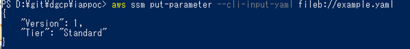

## Systems Manager(SSM) Parameter Storeの利用
AWSのサービスで、機密管理のための安全な階層型ストレージを提供する。  
ECSではタスク定義のコンテナ定義内Secretsにて利用する。  
パスワード、データベース文字列、Amazon Machine Image (AMI) ID、ライセンスコードなどのデータをパラメータ値として保存することができる。  
平文または暗号化してデータを保存できるが、DGCPでは、KMS暗号化を利用する必要がある。  
そのため、利用方法について下記に記載する。  
<br>

1. 下記ファイルを「名前を付けて保存」で任意のディレクトリにyamlファイルを保存する  
```
Name: '/iappoc/t/example' #パラメータストアの名前。/<システム識別子:6桁>/<任意の文字列>
Description: 'example parameter store' #パラメータストアの説明
Value: 'Sample' #実際に入れるバリュー
Type: SecureString #SecureStringを指定
KeyId: 'alias/kms-p-g-dgcp-dev-app-01-01' #非本番本番問わず記載済みのKMSキーを指定する。
Tags:
  - Key: 'Cost1'
    Value: 'iappoc' #システム識別子は変更する
  - Key: 'Cost2' 
    Value: 'Kaihatsu' #環境毎に変更「kaihatsu | kensho | iko | sogo | giji | honban 」
DataType: 'text'
```
<br>

2. ファイルを元にパラメータストアに値を格納する  
`aws ssm put-paramater --cli-input-yaml fileb://[保存したyamlファイルのパス]`
