# 手動デプロイガイド
## 目次
- [前提](#前提)
- [1.イメージのPush](#1イメージのpush)
- [2.タスク定義の作成/更新](#2タスク定義の作成更新)
- [3.ECSサービス(Rolling Update)の更新](#3ecsサービスrolling-updateの更新)
- [4.ECSサービス(Blue/Green Deployment)の更新](#4ecsサービスbluegreen-deploymentの更新)

<br>

<ins>補足資料</ins>
- [タスク定義頻出パラメータ](./appx/taskdef/)
- [Systems Manager(SSM) Parameter Storeの利用](./appx/parameterstore/)

---

<br><br>

## 前提
- edit-<システム識別子>-ua|uにログイン出来ること。  

<ins>**【AWSCLIの場合】**</ins>  
aws sts get-caller-identity を実行する。
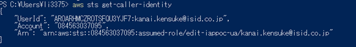  
>スイッチロールツール[okta-awscli>switchRole.ps1](/tools/okta-awscli/)を提供中。

<ins>**【管理コンソールの場合】**</ins>  
ブラウザ右上を確認する。  
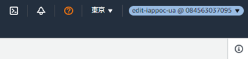

- 管理コンソールは、**旧管理コンソール** でのSS/操作。
<br><br>

## 概念図
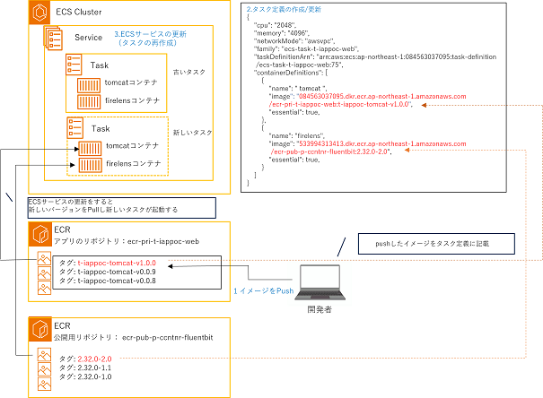  

<br><br>

## 1.イメージのPush

### 1-1. イメージを作成
Dockerfileが存在するディレクトリに移動し下記コマンドを実行

docker build  -t [アプリ名]:[タグ名] .

```Docker Build
# 例
docker build  -t app:latest .
```  

### 1-2．イメージのレポジトリ名、タグ名をAmazon ECRに対応したモノへ変更  
docker tag [buildしたイメージ名] [<span style="color:red;">ECRレポジトリ名</span>:<span style="color: blue;">タグ名</span>]`  


```Powershell
# 例
docker tag app:latest 084563037095.dkr.ecr.ap-northeast-1.amazonaws.com/ecr-pri-t-iappoc-web:work-t-iappoc-tomcat-v1.0.0
```
<br>

### 1-3．イメージをECRへ Push  
以下コマンドを実行する。

```Powershell
aws ecr get-login-password --region ap-northeast-1 | docker login --username AWS --password-stdin "${awsAccount}.dkr.ecr.ap-northeast-1.amazonaws.com"

# docker push [1-1で作成したURI]
docker push 084563037095.dkr.ecr.ap-northeast-1.amazonaws.com/ecr-pri-t-iappoc-web:work-t-iappoc-tomcat-v1.0.0
```  
[Push中]  
  
[Push後]  
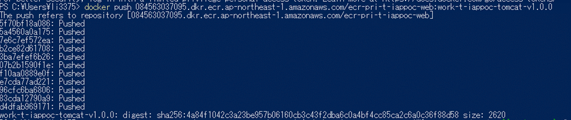  
※最後の行に、digestとsizeが表示されていることを確認。

<br><br>

## 2.タスク定義の作成/更新
### 2-1．現在のタスク定義の確認  
※新規作成の場合は、この手順は省略  

<ins>**【AWSCLIの場合】**</ins>  

##### 2-1-1．タスク定義を取得する  
`aws ecs describe-task-definition --task-definition [タスク定義名]`


<ins>**【管理コンソールの場合】**</ins>   

##### 2-1-1．コンソールへログイン後、「ECS」を検索し、サービスを開く  
  

##### 2-1-2．「タスク定義」を選択して、確認したいタスク定義を押下、表示する
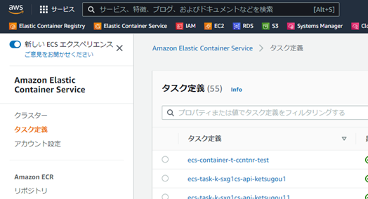  

<br>

### 2-2．タスク定義の作成・更新  
※JSON形式のみ設定できるパラメータが存在するため、**<ins>JSON形式での管理、運用を推奨</ins>**  

<ins>**【AWSCLIの場合】**</ins>  

##### 2-2-1．2-1-1で取得したJSONから以下の要素を削除する
- compatibilities
- revision
- requiresAttributes
- registeredAt
- registeredBy
- status
- taskDefinitionArn

>2-2-1 及び 2-2-2 を簡略化するツール「exportTaskDefinition.ps1」を提供中

#### 2-2-2．タスク定義の設定・パラメータを更新する  
※頻出パラメータは[こちら](./appx/taskdef/){:target="_blank"}

#### 2-2-3．タスク定義を登録する    
`aws ecs register-task-definition --cli-input-json fileb://[作成したタスク定義ファイル].json`
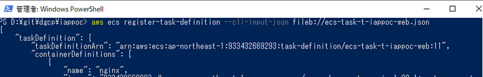  

<ins>**【管理コンソールの場合】**</ins>  

#### 2-2-1. ECSタスク定義の画面から「新しいタスク定義の作成（新規作成）」または「新しいリビジョンの作成（更新）」を押下する
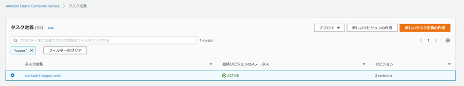

#### 2-2-2．タスク定義の設定パラメータを更新する  
※頻出パラメータは[こちら](./appx/taskdef/){:target="_blank"}
>GUI上の更新方法に関しては管理コンソールは日々改良されていくため、割愛する。  
CLIと同様にJSONファイルを取得・設定が行える（JSONによる設定は旧管理コンソールのみ可能）が、  
取得したJSONはCLIの結果と同一であるため、特定の属性を削除する必要があることに留意すること。  

[新管理コンソールの例]
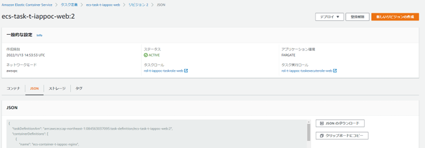

[旧管理コンソールの例]
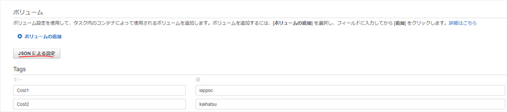

<br><br>

## 3.ECSサービス(Rolling Update)の更新  
### 3-1. 環境変数などの外部注入の値の反映  

<ins>**【AWSCLIの場合】**</ins>  

##### 3-1-1．ECSサービスを更新する  
`aws ecs update-service --cluster [ECSクラスター名] --service [ECSサービス名] --force-new-deployment`  
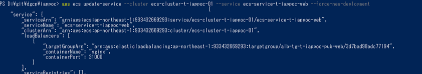  


<ins>**【管理コンソールの場合】**</ins>  

#### 3-1-1. AWS管理コンソールにログイン後、「ECS」を検索し、コンソールを開く  
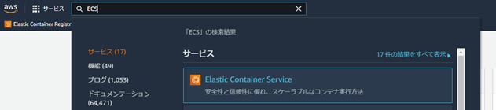  

#### 3-1-2. 「クラスター」を選択して、更新したいサービスのあるクラスターを一覧から選択する  
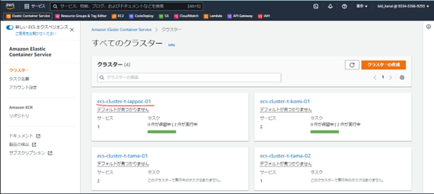  

#### 3-1-3. タスクを更新する「サービス」を選択して、「編集」を押下する  
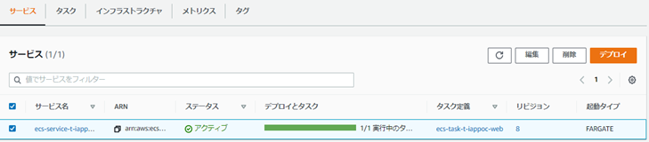  

#### 3-1-4. 「新しいデプロイの強制」にチェックボックスを入れ、「更新」を押下する  
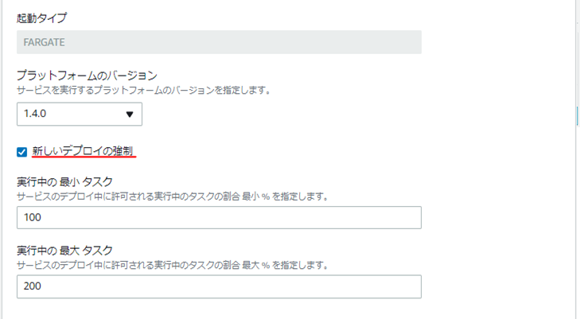  

<br>

### 3-2. タスク定義の反映  

<ins>**【AWSCLIの場合】**</ins>  

##### 3-2-1．ECSサービスを更新する  
`aws ecs update-service --cluster [ECSクラスター名] --service [ECSサービス名] --task-definition [タスク定義名]`  
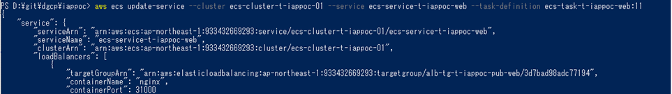  

●aws ecs update-serviceの頻出パラメータ  

| オプション | 説明 |
| --- | --- |
| --task-definition | サービスで使用するタスク定義を設定する。基本的にはリビジョンも含めて指定すること。 |
| --desired-count | ECSが管理するサービスのタスク数。<br>稼働中のタスク数があっていない場合、ECSによって調整される。 |
| --force-new-deployment | 新しいデプロイの強制。外部注入側を変更した際に実行する。 |
| --health-check-grace-period-seconds | ALBのヘルスチェックの猶予期間(秒)。<br>コンテナの起動に時間がかかる場合は、このパラメータの設定を変更する。 |
| --enable-execute-command | docker execのECS版。<br>Trueに設定したサービスによって作成されたタスクからコンテナ内にログイン出来る。<br>DGCP標準ではfalse |

<ins>**【管理コンソールの場合】**</ins>  

#### 3-2-1. AWS管理コンソールにログイン後、「ECS」を検索し、コンソールを開く  
  

#### 3-2-2. 「クラスター」を選択して、更新したいサービスのあるクラスターを一覧から選択する  
  

#### 3-2-3. タスクを更新する「サービス」を選択して、「編集」を押下する  
  

#### 3-2-4. 「タスク定義」の「リビジョン」を登録したものに設定し、「更新」を押下する  
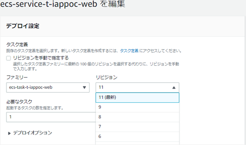  


<br><br>

## 4.ECSサービス(Blue/Green Deployment)の更新
### 4-1. 環境変数などの外部注入の値の反映  
※管理コンソールの方のみ、特別な方法で再デプロイが可能なため記載する。  

#### 4-1-1. AWS管理コンソールにログイン後、「CodeDeploy」を検索し、コンソールを開く  
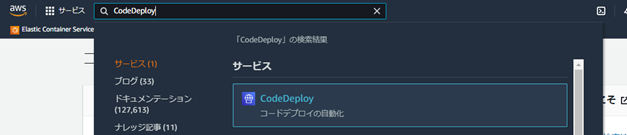  

#### 4-1-2. 「アプリケーション」を選択して、ECS Serviceで利用している「アプリケーション」を選択する  
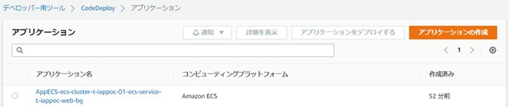  

#### 4-1-3. 「デプロイ」タブを開き、元に戻したいリビジョンの「デプロイＩＤ」を選択する  
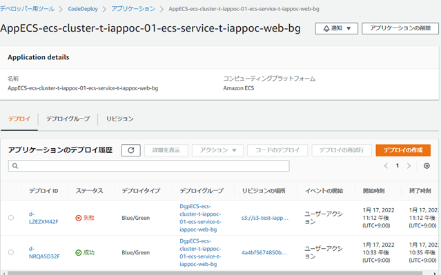  

#### 4-1-4. 「デプロイの再試行」を選択する  
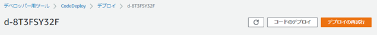  

#### 4-1-5. 「デプロイの再試行」を選択する  
  

<br>

### 4-2. タスク定義の反映  

<ins>**【AWSCLIの場合】**</ins>  

##### 4-2-1．AppSpecファイルを準備し（s3に配置する）、リビジョンは任意のものを指定する  
```
# 例: s3-test-iappoc-fsv-01/AppSpec.yamlを配置

version: "0.0"
Resources:
  - TargetService:
      Type: AWS::ECS::Service
      Properties:
        TaskDefinition: "arn:aws:ecs:ap-northeast-1:084563037095:task-definition/ecs-task-t-iappoc-web:12" #タスク定義Arn
        LoadBalancerInfo: 
          ContainerName: "ecs-container-t-iappoc-nginx" #LBからリクエストを受け取るコンテナ名
          ContainerPort: "31000" #LBからリクエストを受け取るポート
```

##### 4-2-2．CodeDeployを実行する  
```
aws deploy create-deployment `
                 --application-name [アプリケーション名] `
                 --deployment-group-name [デプロイグループ名] `
                 --description [説明文], `
                 --revision revisionType=S3 `
                 --s3-location bucket=[S3バケット名],key=[ファイルへのキー],bundleType=YAML
```
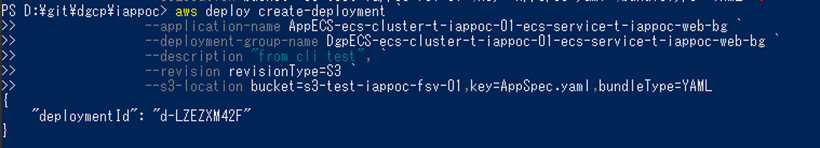  

<ins>**【管理コンソールの場合】**</ins>  

#### 4-2-1. AWS管理コンソールにログイン後、「CodeDeploy」を検索し、コンソールを開く  
  

#### 4-2-2. 「アプリケーション」を選択して、ECS Serviceで利用している「アプリケーション」を選択する  
  

#### 4-2-3. 「デプロイグループ」タブを開き、デプロイしたいECS Serviceが登録されている「デプロイグループ」を選択する  
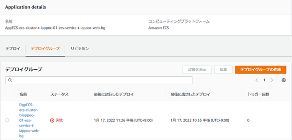  

#### 4-2-4. 「デプロイの作成」を選択する  
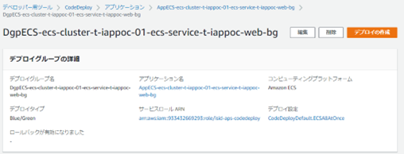  

#### 4-2-5. リビジョンタイプで「Amazon S3」を選択し、AppSpecファイルがあるＳ３バケットのパスを記述し、「デプロイの作成」を押下する  
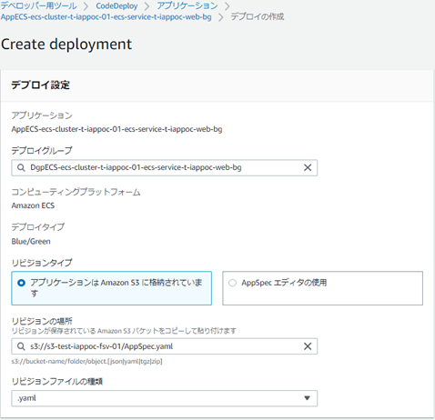  

#### 4-2-6. タスクが起動し、Target Groupに設定された場合、以下のような画面が表示される    
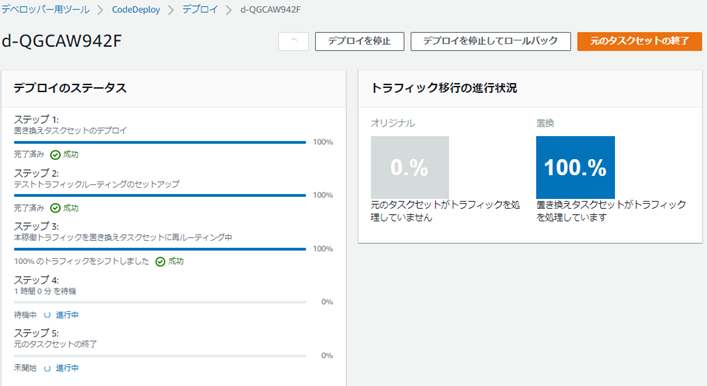  
稼働確認を実施後、問題なければ「元のタスクセットの終了」を押下し、デプロイを完了する。  

<br><br>