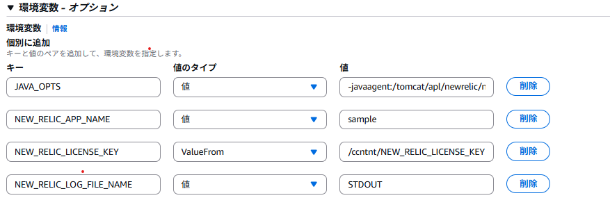

# NewRelic Javaエージェント導入ガイド

## 1. 前提
- Javaエージェントのインストール要件を満たしていること。  [公式サイト](https://docs.newrelic.com/jp/docs/apm/agents/java-agent/getting-started/compatibility-requirements-java-agent/)  
- パラメータストアにライセンスキーが 追加されていること。  
    - ここでは`/システム識別子/NEW_RELIC_LICENSE_KEY`にライセンスキーが設定されているものとして説明します。
    
    
## 2. Dockerfileの修正

NewRelicのモジュールをダウンロードし任意のディレクトリに展開します。  

```dockerfile
# ダウンロード 
RUN curl -L -o /tmp/newrelic-java.zip https://download.newrelic.com/newrelic/java-agent/newrelic-agent/current/newrelic-java.zip
# インストールディレクトロり作成 
RUN mkdir -p /tomcat/apl/newrelic

# 解凍
RUN unzip -d /tmp/ /tmp/newrelic-java.zip
# コピー
RUN cp /tmp/newrelic/newrelic.jar /tomcat/apl/newrelic/newrelic.jar 
RUN cp /tmp/newrelic/newrelic.yml /tomcat/apl/newrelic/newrelic.yml 

# 不要ファイル削除
RUN rm -rf /tmp/newrelic*

```


## 3. タスク定義（環境変数）の修正


下記のようにコンテナの環境変数を変更します。  
  

<BR>

| 変数名 | 値 | 備考 |
| -- | -- | -- |
| NEW_RELIC_APP_NAME | アプリケーション名を定義します。 | NewRelicの`APM&Services/Services-APM`に表示されます。|
| NEW_RELIC_LOG_FILE_NAME | `STDOUT`を入力 | コンテナの場合、標準出力を指定します。|
| NEW_RELIC_LICENSE_KEY | `/システム識別子/NEW_RELIC_LICENSE_KEY`を入力| パラメータストアを指定します。|
| JAVA_OPTS | Dockerfileで配置した`newrelic.jar`を-javaagent引数で追加します| 例）-javaagent:/tomcat/apl/newrelic/newrelic.jar |


{: .note}  
`JAVA_OPTS`の環境変数はDGCPが提供しているTomcatのBaseImageを使用している場合に、有効な環境変数です。  
それ以外は下記のように`JAVA_OPTS`を引数で渡すようにDockerfileを修正してください。  
CMD ["bash", "-c", "java $JAVA_OPTS -jar dgcpSampleApp.jar"]


## 3. タスクの再起動

```powershell
aws ecs update-service  --cluster [クラスター名] --service [サービス名] --force-new-deployment   
```  
