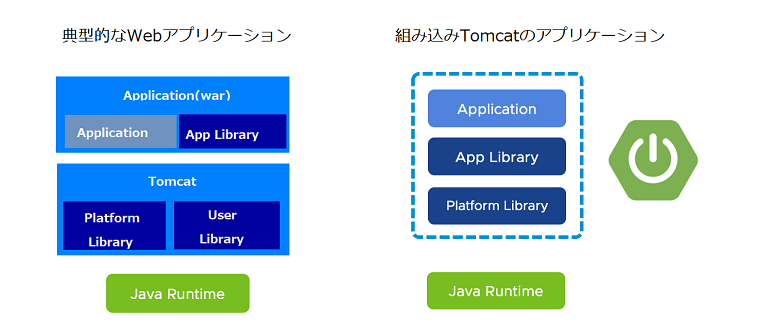
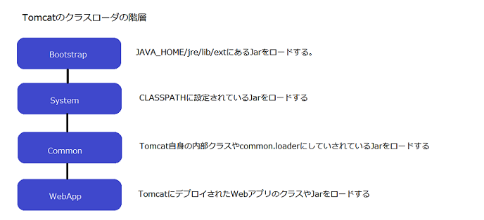

# 通常のTomcatと組込Tomcatの開発者視点での差異

1. 構造上の違い
  

    1. 左がこれまで開発していたWebアプリケーションの構造で、右が組込みSpringBoot+Tomcatの構造です。  
これまでは、Tomcatなどの上にアプリのWarファイルを配置し動作させていました。これはアプリ本体がAppLibrary  
（Jarファイル群）を  参照し、ミドルウエアの構造やJavaランタイムに依存するという特性があります。  
これは、アプリケーションが依存する様々なミドルやライブラリをアプリから切り離して、他のアプリで再利用できる  
というメリットがある一方、ライブラリが複数の階層でロードされるため複雑になりがちというデメリットもあります。　　

    1. 一方で右の図は、SpringBoot+組込みTomcatの構造である。これは、Tomcatとアプリを一つのパッケージ  
（Executable Jar）にまとめ、それをJavaRuntimeで動作させるという方式で、ミドルウェア内のライブラリーの再利用性は  
なくなるものの、変更や移植の難易度が大幅に低くなる特徴があります。

1. 組込みTomcatを使用する上での考慮事項
    1. クラスロードの差異  
 通常のTomcatでは、システムクラスローダ、Tomcat共通クラスローダ、WebAppクラスローダなどに   
 分割され、ライブラリのロードする順番が決定されており、クラスパスの順番を考慮する必要がありました。  
  一方、SpringBoot+組込みTomcatでは、アーカイブ自体がNested Jarという形式でクラスパスの順番は、BOOT-INF/classpath.idx  
 というファイルで制御されています。このJarファイルは、JavaのJarファイルの形式と互換性があるものの拡張されてた仕様だ  
 ということを認識する必要があります。

          

        SpringBootのクラスパスインデックス
        ```classpathindex1
        example.jar  
          |  
          +-META-INF  
          |  +-...  
          +-BOOT-INF
             +-classpath.idx  
             +-classes  
             |  +...  
             +-lib  
               +-dependency1.jar  
               +-dependency2.jar  
        ```
        ```classpathindex2
        classpath.idx
         - "BOOT-INF/lib/dependency2.jar"  
         - "BOOT-INF/lib/dependency1.jar"  
        ```
    
1. Tomcatの設定はアプリで設定する  
これまでのようにTomcatの設定は、serever.xmlなどには行いません。アプリケーションのロジックや設定ファイル  
に記載することで、Tomcatの設定を行うことができる点が従来のTomcatとは異なります。  
最低限の設定はDGCPが提供するライブラリで設定可能ですが、基本的にはアプリチームの管理で行います。  


1. 1アプリ1組み込みサーバー構成とする
    1. 複数のアプリをデプロイすることはできないため、ロードバランサからのヘルスチェックや管理ツールなどは  
 アプリの中に組み込みます。  
    1. 複数のアプリをデプロイしていた従来のTomcatでは、アプリ全体でサイジングを行っていたが、組込みTomcatでは  
 アプリケーション毎に必要なメモリをそれぞれ確保する必要があります。

1. バージョン管理
    1. Tomcat、Javaのバージョン管理をアプリが行います。  
    これまでの開発では、ＡＰサーバを管理するチームが新しいバージョンの標準化を行い  
    アプリチームは受動的にバージョンアップを行ってきたが、組込みTomcatの場合は、アプリと一体化しているため  
    アプリチーム主体で能動的にバージョンアップを行わなければならない。 
<br>
    1. その他ライブラリ（DBドライバなど）の管理もアプリで行います。  
    CLASSPATHに設定していたJDBCドライバなどは、Executable Jarの中に組込むため、アプリチームで  
    能動的にバージョンアップを行わなければならない。 
<br>
1. アプリのログ以外の考慮  
    1. 従来型のシステムはAPサーバのログは、APサーバを担当するチームがログの形式を定義し出力していました。  
しかし、組込みTomcatの場合は、APサーバのログもアプリのログとして出力させるような考慮が必要です。

1. コンテキストパスの考慮  
    1. 従来型のシステムはContextデスクリプタやWarファイルを展開したディレクトリ名がコンテキストパス  
    となっていたが、組込みTomcatでは、アプリの設定を行わなければならない。  
    特にインターネットに公開するアプリは、コンテキストフィルタが必要となるため考慮が必要。


